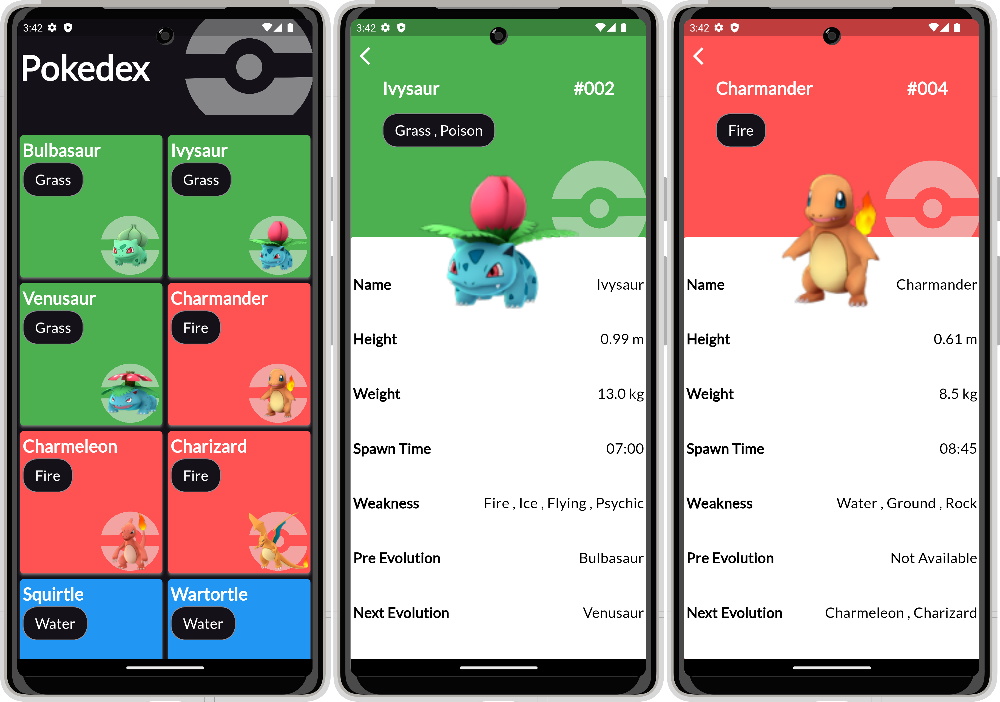

# Pokedex

Pokedex Application

 
 

## Built With 

- [Flutter&Dart](https://docs.flutter.dev/get-started/codelab)
- [Basic Widgets](https://docs.flutter.dev/ui/widgets/basics)
- [Material Component Widgets](https://docs.flutter.dev/ui/widgets/material)
- [Async Widgets](https://docs.flutter.dev/ui/widgets/async)
- [Dio](https://pub.dev/packages/dio)
- [Screen Utils](https://pub.dev/packages/flutter_screenutil)
- [Google Fonts](https://pub.dev/packages/google_fonts)
- [Cached Network Image](https://pub.dev/packages/cached_network_image)